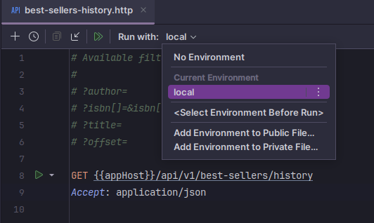

# Lendflow Assessment: NYT Best Sellers List & Filter.

## Table of contents.
- [Requirements.](#system-requirements)
- [Installation instructions.](#installation-instructions)
- [How to use application.](#how-to-use-application)
- [Additional information.](#additional-information)

## System requirements.
- PHP >=8.1
- Laravel ^10.0

## Installation instructions.

- Install application dependencies via composer:
```shell script
composer install
```

- Add `.env` file via command if the file does not exist:
```shell script
php -r "file_exists('.env') || copy('.env.example', '.env');"
```

- Generate application encryption key:
```shell script
php artisan key:generate
```

- Set NYT API key:
```dotenv
NYT_API_KEY=
```

- **(Optional)**. Set ENV variable for cache TTL (default value is 3600 seconds):
```dotenv
CACHE_TTL=
```

- **(Optional)**. Set ENV variable with cache prefix (current value is `bestSellers`)
```dotenv
CACHE_PREFIX=
```

- Make sure that configuration changes are applied:
```shell
php artisan o:c
```
## How to use application.

### API.
Endpoint can run using built in 
[PhpStorm HTTP Client](https://www.jetbrains.com/help/phpstorm/http-client-in-product-code-editor.html) and
`.http` files where sample itself is configured.

It can be found in `requests/v1/best-sellers-history.http`. But to run endpoint, we need to configure
 environment a bit:
- Make a copy of file `http-client.private.env.json.dist` in the `requests` directory. File name
must be `http-client.private.env.json`:


- In created file set client variable `local.appHost` with the host of application on your environment.
- Open file `requests/v1/best-sellers-history.http` and select environment `local`:



- Add necessary filters mentioned on lines 1–6 and click on "Run" button on the line 8.

### CLI.

Application provides a shortcuts for a useful commands:
* `composer test` - shortcut for `php artisan test`.
* `composer format` - shortcut for `./vendor/bin/pint` for code auto-formatting.
* `composer analyse` - shortcut for `/vendor/bin/phpstan analyse`.

# Additional information.

1. Filters validation is performed by `\App\Http\Requests\v1\BestSellerHistoryListRequest` class.
2. Communication with Books API is handled by `\App\Services\v1\BookService` class.
3. Exceptions handling and their rendering to API response are performed by built-in Laravel's 
   `\App\Exceptions\Handler` class.
4. API route is defined in `routes/api/v1.php` file.
